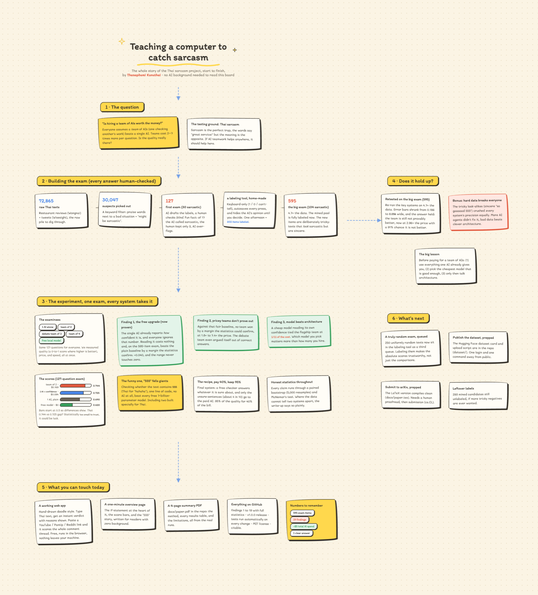
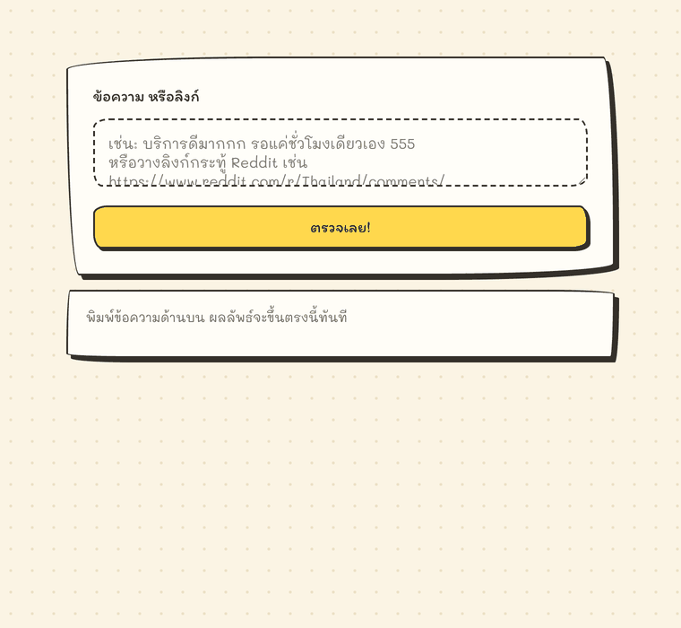

# Cost-Aware Multi-Agent LLM Evaluation for Thai Sarcasm Detection

Are multi-agent LLM systems actually worth the extra cost? I set out to prove they are, on the hard problem of
detecting Thai sarcasm (ประชด). The honest answer surprised me, and finding it is what this project is really about.

**A single cheap model that reads its own confidence ties a multi-agent system costing 11 times more.** Stacking
agents, debate panels, and verifiers did not beat one well-used model by any margin the statistics could tell apart.
The real lever was choosing a cheaper model and reading its confidence score, not adding agents.

This repo is the whole story: eleven experiments, proper statistics, a deployable tool, and a demo you can play with.

What you can access here:

- **[Live detector](https://thanaphumi2006.github.io/Cost-Aware-Multi-Agent-LLM-Evaluation-for-Thai-Sarcasm-Detection/app.html)**, paste Thai text or a comment-thread link, get a verdict with the reasons shown. Runs in your browser; nothing you type leaves your machine. (Same file: [`app.html`](app.html))
- **[One-minute visual overview](https://thanaphumi2006.github.io/Cost-Aware-Multi-Agent-LLM-Evaluation-for-Thai-Sarcasm-Detection/overview.html)** of what the system does and how each method scored, for readers without an ML background. (Same file: [`overview.html`](overview.html))
- **[4-page summary PDF](docs/paper.pdf)** with the method, all results tables, and limitations.
- **[Interactive story board](https://claude.ai/code/artifact/47aa95d4-86a2-47f9-959f-487b258c936e)**, the whole project in six chapters, Miro-style, in the same doodle look as the demo (pictured below).
- **[Full findings, 1 to 21](Gold/RESULTS.md)** with the statistics behind every claim, and the code that produced them in [`Gold/`](Gold/).

<details>
<summary><b>The whole project on one board</b> (click to expand)</summary>
<br>

</details>

## The 60-second version

- I put five systems on the same 127 examples and measured four things at once, not just accuracy: **quality (F1),
  cost, speed, and number of API calls.** The systems: a single agent, a two-agent pipeline, a three-agent debate,
  a four-agent hybrid, and a free model that runs on your own machine.
- The two-agent pipeline looked like the clear winner (F1 0.744 vs the single agent's 0.690). But that single-agent
  baseline was fighting with one hand tied: it was throwing away the model's own confidence score.
- Once I let the single agent read that score and tuned one threshold, it jumped to **0.725 for free**, with zero
  extra API calls. Compared fairly against that, **no multi-agent system won by a statistically significant margin,
  and several cost 2 to 7 times more.**
- Switching to a cheaper model mattered far more than any architecture choice. A model **6 times cheaper** than the
  flagship scored just as well.
- The lesson: before you ask "should I add another agent?", ask "have I used everything the one agent already gives
  me?" Half of the multi-agent "win" was just the baseline wasting information it had already paid for.

Every claim here is backed by a paired bootstrap (5,000 resamples) and McNemar's test, reported with confidence
intervals, not a single lucky run.

## The detector


Paste Thai text, get a verdict, **sarcastic / not sarcastic / can't tell**, with the reason shown.
Or paste a **YouTube / Pantip / Reddit link**: with the local helper running (`python Gold/app.py`,
which fetches what browsers cannot due to CORS), the page pulls the thread's comments and scores
them all — free and cue-only by default, with nothing leaving your machine unless you click to
escalate an unclear comment to the paid model.



**To run it: [use the live page](https://thanaphumi2006.github.io/Cost-Aware-Multi-Agent-LLM-Evaluation-for-Thai-Sarcasm-Detection/app.html)**, or download [`app.html`](app.html) and open it in any browser, one file, no install, no
server, works offline either way. Nothing you type leaves your machine.

It has no model and no server-side dependency, it's regex plus a little arithmetic, so a plain page
is the honest shape for it: no quota to hit, no cold start, nothing to keep paying for. A Gradio
version for Hugging Face Spaces lives in [`space/`](space/) (blocked by the free CPU quota), and
[`space/verify_port.py`](space/verify_port.py) checks the browser build returns identical verdicts to
the Python one, currently **12/12**.

<details>
<summary><b>One-minute visual summary of the whole project</b> (click to expand)</summary>
<br>

<br><br>
Source: <a href="overview.html">overview.html</a>, open it locally for the live version.
</details>

Two deliberate differences from the local app. It runs on **lexical cues only** (a fine-tuned
WangchanBERTa can't run in a browser, and in any case it scored **5/10 on unseen sentences versus 8/10
for the cues** — with 127 training examples it memorised the set instead of learning sarcasm, see
[`space/README.md`](space/README.md) and finding 21). And it answers **"can't tell"** whenever no
*strong* cue is present rather than guessing — the cue only commits when its signal clears
`|score| ≥ log(2.46)`, which is the change that lifts F1 from 0.63 to 0.81 (finding 21). Everything
weaker is left for the escalation path when you attach the local helper.

## The interactive app (local, with GPT)

Run it locally with `python Gold/app.py` (see [Run it](#run-it)); it binds to `127.0.0.1` on purpose,
because an API-key box on a public URL is a way for strangers to spend your money. Two pages:

**`/app` — the clean demo** (the same [`app.html`](app.html) that's hosted on GitHub Pages, served locally so
links and GPT work). It runs a **cost-aware cascade**, drawn as a little hand-drawn animation on the page:

1. **cue** (free, in your browser) answers only when a surface signal is *strong enough* (`|score| ≥ log(2.46)`);
2. **WangchanBERTa** (free, on your machine) clears items it's confident aren't sarcastic;
3. **gpt-4.1-mini** (paid) is called only for what both free tiers couldn't settle.

The cue cut-off in step 1 is the measured win (F1 0.63 → 0.81 at ~42% of the LLM cost, finding 21); steps 2–3 are
the escalation path, and each tier degrades gracefully — no helper falls back to cue-only, no key falls back to
"can't tell". Paste Thai text or a **YouTube / Pantip / Reddit** link and every comment runs the same cascade.

**`/` — the developer page**, for comparing systems side by side. You can:

- **Pick a helper model,** each drawn as a little character: a fast cheap one, a thorough expensive one, a two-agent
  team (with an animated workflow), and the free offline model.
- **Teach it when it is wrong.** Press "wrong" on a result and the correction sticks: it is saved, and used to get
  similar cases right next time. (This is in-context learning from examples, not retraining the model, and the
  interface says so honestly.)

## Unattended use (auto-labelling, auto-reply)

If the system must act **without a human in the loop**, precision matters more than coverage, and thresholding the
LLM alone will not give it: gpt-4.1-mini's false positives are as confident as its true ones, so precision is stuck
near 0.68 at every threshold. **[`Gold/autolabel.py`](Gold/autolabel.py)** solves it with an AND-gate: it auto-acts
only when two independent signals (the lexical cue and the LLM) agree, and sends everything else to a review queue.

```bash
python Gold/autolabel.py --csv comments.csv --out labelled.csv        # text[,label] -> decisions
```

On the 127-item gold set this auto-labels **52%** of items (precision **0.90** for sarcastic, **0.96** for
not-sarcastic) and defers the other 48% to a human, rather than mislabelling them. It is cost-aware: the LLM is
called only on the items the cue tier is confident about. The precision figures rest on few positives (wide CIs);
the mechanism (act only on agreement) is the durable part.

## The finding, in one table

All systems, same 127 items, same measurement code:

| System | F1 | Precision | Recall | API calls | Cost | Speed (p50) |
|---|---|---|---|---|---|---|
| Single agent (plain) | 0.690 | 0.526 | **1.000** | 127 | $0.094 | 751 ms |
| **Single agent + threshold** (reads its own confidence) | 0.725 | 0.641 | 0.833 | 127 | **$0.094** | 751 ms |
| Two-agent pipeline (screener then verifier) | **0.744** | 0.604 | 0.967 | 183 | $0.169 | 967 ms |
| Debate (3 agents) | 0.694 | 0.595 | 0.833 | 381 | $0.695 | 4,557 ms |
| Hybrid (4 agents) | 0.700 | 0.560 | 0.933 | 292 | $0.407 | 832 ms |
| WangchanBERTa (free local model) | 0.620 | 0.553 | 0.700 | **0** | **$0.00** | **26 ms** |

When you compare each multi-agent system against the *tuned* single agent (0.725), every confidence interval crosses
zero. None of them wins by a margin the data can actually resolve:

| System | Difference vs tuned single agent | 95% CI | Chance it is not better | Cost |
|---|---|---|---|---|
| Two-agent pipeline (best) | +0.019 | [-0.073, +0.113] | 36% | 1.8x |
| Hybrid | -0.025 | [-0.117, +0.071] | 70% | 4.3x |
| Debate | -0.030 | [-0.158, +0.096] | 69% | 7.4x |

And the model matters more than the architecture. The same tuned single agent across five models spanning a 25x price
range stays inside a 0.05 F1 band, with the best score belonging to one of the cheaper models. A cheap single agent
(gpt-4.1-mini, F1 0.727, $0.015) is statistically tied with the flagship two-agent pipeline (gpt-4o, F1 0.744, $0.169)
at **one eleventh of the cost.**

Full numbers, confidence intervals, and McNemar counts are in **[`Gold/RESULTS.md`](Gold/RESULTS.md)** (findings 1 to 21).

**Replicated at 4.7x the data (finding 19).** The gold set was later expanded to 595 items
(104 sarcastic, labeled blind via `Gold/label_ui.py`) and the core systems re-run. Two results:

- **The free upgrade is now proven.** Letting the single agent read its own confidence beats the
  plain baseline by +0.040 F1, 95% CI [+0.018, +0.060], the first time this interval excludes zero.
  Same model, same number of API calls, same $0.275. McNemar 80 to 6.
- **The multi-agent verdict holds, and leans further against it.** Measured against that fair
  baseline the pipeline is -0.019 (95% CI [-0.047, +0.009]) at 2.96x the cost, with a 91% chance
  it is not better. The confidence interval has narrowed from 0.186 wide at n=127 to 0.056 here.

Absolute scores on that set are lower by design (its negatives are pre-selected look-alikes, a hard
set), which surfaced a bonus finding: hard negatives collapse precision for every architecture
equally, so adding agents does not fix it.

**The honest reality check (finding 20).** Every gold set above was keyword-mined to be
17 to 24% sarcastic. A uniformly random sample of Thai social text is only **4.9% sarcastic**, and on
that realistic distribution the celebrated numbers evaporate: the free cue detector falls from F1
0.59 to **0.09**, and GPT with plain argmax flags 36% of all text as sarcastic (F1 0.20). The one
thing that survives is the free confidence-reading upgrade, which cuts the flag rate to 6% and lifts
F1 to **0.46**, its largest single improvement anywhere in the project. Sarcasm detection on real
traffic is harder than any headline number suggested, and reading the confidence you already paid for
is what separates a usable system from an unusable one.

## Why I trust these numbers (and you can too)

This is the part I care about most, and the part that makes the result more than an opinion:

- **Paired testing.** Every system runs on the exact same items, so I compare them item by item with a paired
  bootstrap and McNemar's test, not two separate averages.
- **No leakage in the threshold.** The confidence threshold is chosen leave-one-fold-out, so no example ever helps set
  the cutoff that then judges it.
- **Confidence intervals everywhere.** With only 30 sarcastic examples, a bare number is meaningless. Every claim
  carries an interval, and I say plainly when the data cannot resolve a difference.
- **I report what does not work.** The cascade idea (a free model screening for the expensive one) failed, and it is
  written up as a finding, not hidden (finding 6, and re-measured one tier deeper in finding 21, where a free-constant
  control ties the WangchanBERTa tier exactly).

## Honest limitations (read before citing anything)

- **Do not look at accuracy.** The data is 76% not-sarcasm, so always guessing "not sarcasm" already scores 0.76.
  Accuracy hides everything that matters here.
- **The dataset is small and a bit biased.** 30 sarcastic examples is not enough to settle a ~0.02 F1 difference, and
  some of those positives were mined with GPT-4o, which likely inflates its recall. The bias hits every system
  equally, so the comparison stays fair, but the absolute numbers should be read with care (details in
  [`Gold/PROVENANCE.md`](Gold/PROVENANCE.md)).
- **It does not transfer cleanly to other domains.** I validated this: on a hand-labeled sample of 55 Pantip comments,
  precision fell from 0.68 to 0.40, because the model flags genuine praise as sarcasm (9 false positives), while recall
  stayed high. So outside reviews and tweets it cries wolf on sincere praise. Use it on similar content, or label a
  sample of your target domain and re-tune: **`Gold/calibrate_domain.py`** does the collect → label → re-tune loop
  end to end (runbook: [`Gold/CALIBRATE.md`](Gold/CALIBRATE.md)), or use the web app's "correct it" button for a
  zero-setup in-context version. Full write-up: finding 12 in `Gold/RESULTS.md`.

## Run it

Use a virtual environment. Your system `python` may be a different one (for example Anaconda) where Flask does not
work, which is the usual reason the web demo will not start.

```bash
python3 -m venv .venv              # first time only
source .venv/bin/activate          # do this in every new terminal (Windows: .venv\Scripts\activate)
pip install -r requirements.txt    # pinned, validated set (includes torch for the WangchanBERTa tier)

export OPENAI_API_KEY=sk-...       # Windows: set OPENAI_API_KEY=sk-...  (or put it in .env)

python Gold/train_final_wcb.py     # once: builds Gold/wcb_model/ (404 MB, not in the repo). ~11 min on CPU.
python Gold/app.py                 # web demo at http://127.0.0.1:5000  (user page: /app)
```

The `train_final_wcb.py` step is only needed for the WangchanBERTa middle tier; skip it and the
cascade degrades gracefully to cue → GPT. Everything else (the cue cut-off, link fetching, GPT
escalation) works without it.

Once the demo is running, other commands (in the same activated terminal):

```bash
python Gold/predict.py "ขอบคุณที่ให้รอ 2 ชั่วโมง บริการดีจริงๆ"   # command-line, one sentence
python Gold/predict.py --csv reviews.csv --out scored.csv          # a whole file
```

Reproduce the research:

```bash
cd Gold
python baseline.py            # single agent
python multiagent.py          # two-agent pipeline
python compare_systems.py     # all systems + the statistics
```

The web page keeps your API key in server memory only (never written to disk), and runs on `127.0.0.1`.

**Hosting it publicly?** Don't expose `app.py` — it has a key-input box and batch/correction endpoints
that must stay local. Use **`Gold/serve_public.py`** instead: a minimal server that mounts only the
demo page plus the fetch and escalate endpoints, takes the key from the environment only, allowlists
fetch hosts (SSRF-safe), rate-limits and size-caps every request, and sets hardening headers. Full
deployment runbook (gunicorn/waitress + HTTPS reverse proxy): [`Gold/HOSTING.md`](Gold/HOSTING.md).

## What is in here

```
Gold/
  gold.csv               the 127-item evaluation set (Wongnai reviews + Wisesight tweets)
  labeling_rubric.md     how sarcasm was defined (it requires feigned praise, "การเสแสร้ง")
  baseline.py            single agent
  multiagent.py          two-agent pipeline (screener then verifier)
  multiagent_debate.py   debate    ·   multiagent_hybrid.py   hybrid
  wangchanberta.py       the free local model (5-fold cross-validation)
  compare_systems.py     paired bootstrap + McNemar
  predict.py             the deployable tool (the research conclusion, packaged up)
  autolabel.py           unattended high-precision auto-labelling (cue AND LLM must agree, else defer)
  app.py                 the web demo (developer page at /, doodle user page at /app) — LOCAL only
  serve_public.py        hardened server for public hosting (safe subset of app.py) — see HOSTING.md
  HOSTING.md             how to expose the demo safely (WSGI + HTTPS proxy, SSRF/rate-limit notes)
  cascade_eval.py        finding 21: offline eval of the cue → WCB → LLM cascade (free, no API)
  cue_cutoff_cv.py       finding 21: cross-validated cue cut-off, the F1 0.63 → 0.81 win (free)
  wcb_calibration_check.py  finding 21: shows the deployed WCB tier's threshold doesn't transfer
  eval_domain.py         measure the model on any labeled domain, with confidence intervals
  calibrate_domain.py    collect → label → re-tune the threshold for YOUR domain (see CALIBRATE.md)
  CALIBRATE.md           the per-domain calibration runbook (the make-or-break step for real use)
  gold_v2.csv            the expanded 302-item hard set (67 sarcastic)
  label_ui.py            keyboard labeling tool (harvest / batch400 / random queues)
  random_to_label.csv    250 uniformly random texts, unlabeled, for honest absolute scores
  gold_random.csv        250 uniformly random texts, human-labeled: the honest 4.9%-sarcastic test set
  RESULTS.md             the full write-up, findings 1 to 21
dataset/
  README.md              Hugging Face dataset card for the gold set (two splits)
  upload_hf.py           builds the splits and uploads them (needs huggingface-cli login)
docs/
  paper.pdf              4-page summary (Thai script rendered)
  paper.tex              the same paper as arXiv-ready LaTeX (compiles clean)
```

Not included (regenerable, too large for GitHub): the trained model weights `Gold/wcb_model/` (run
`train_final_wcb.py`) and the raw scraped text, neither of which is needed to reproduce the results.
