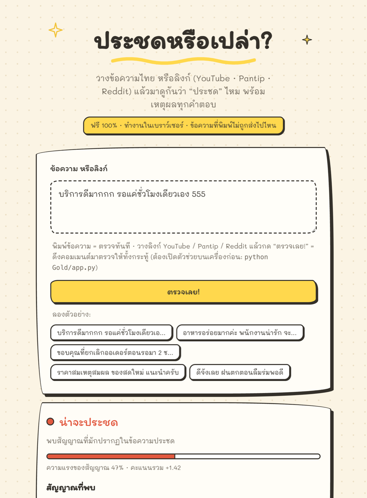
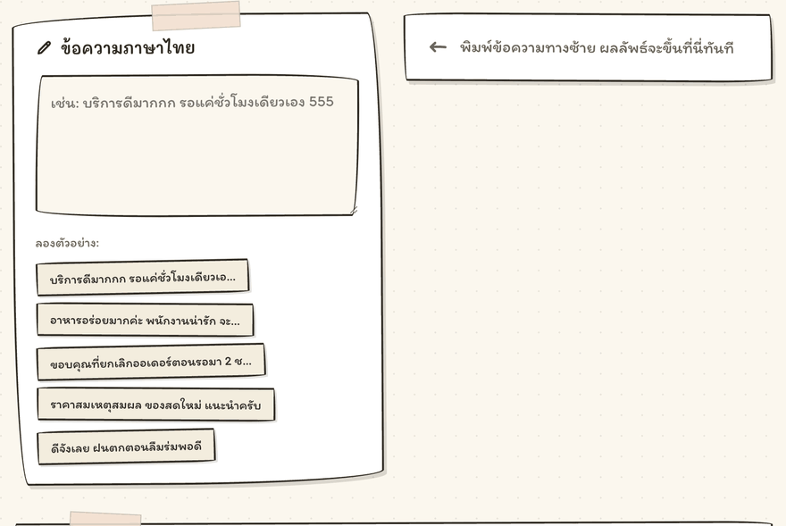
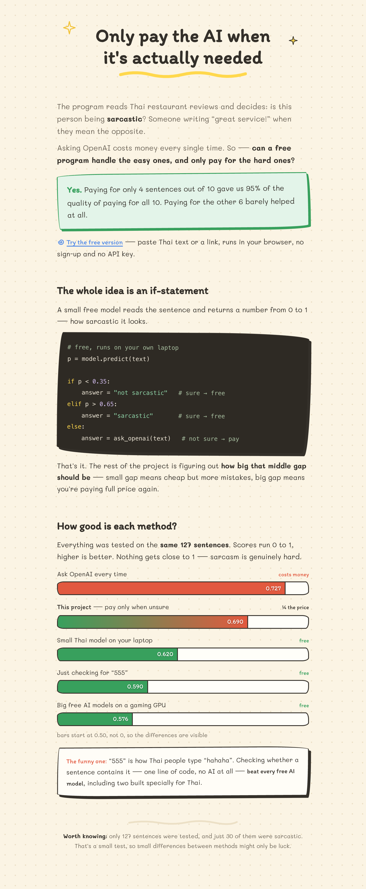

# Cost-Aware Multi-Agent LLM Evaluation for Thai Sarcasm Detection

Are multi-agent LLM systems actually worth the extra cost? I set out to prove they are, on the hard problem of
detecting Thai sarcasm (ประชด). The honest answer surprised me, and finding it is what this project is really about.

**A single cheap model that reads its own confidence ties a multi-agent system costing 11 times more.** Stacking
agents, debate panels, and verifiers did not beat one well-used model by any margin the statistics could tell apart.
The real lever was choosing a cheaper model and reading its confidence score, not adding agents.

This repo is the whole story: eleven experiments, proper statistics, a deployable tool, and a demo you can play with.

**New here? [Open the live overview](https://thanaphumi2006.github.io/Cost-Aware-Multi-Agent-LLM-Evaluation-for-Thai-Sarcasm-Detection/overview.html)** — a one-minute visual summary of what
the system does and how each method scored, written for readers without an ML background.
(Same page as [`overview.html`](overview.html) if you prefer to open it locally.)

**[Try the live detector](https://thanaphumi2006.github.io/Cost-Aware-Multi-Agent-LLM-Evaluation-for-Thai-Sarcasm-Detection/app.html)** — paste Thai text, get a sarcasm verdict with the reasons shown. Runs entirely in your browser; nothing you type leaves your machine.

**Prefer a paper?** A 4-page write-up in research-paper format: [`docs/paper.pdf`](docs/paper.pdf).

## The 60-second version

- I put five systems on the same 127 examples and measured four things at once, not just accuracy: **quality (F1),
  cost, speed, and number of API calls.** The systems: a single agent, a two-agent pipeline, a three-agent debate,
  a four-agent hybrid, and a free model that runs on your own machine.
- The two-agent pipeline looked like the clear winner (F1 0.744 vs the single agent's 0.690). But that single-agent
  baseline was fighting with one hand tied: it was throwing away the model's own confidence score.
- Once I let the single agent read that score and tuned one threshold, it jumped to **0.725 for free**, with zero
  extra API calls. Compared fairly against that, **no multi-agent system won by a statistically significant margin,
  and several cost 2 to 7 times more.**
- Switching to a cheaper model mattered far more than any architecture choice. A model **6 times cheaper** than the
  flagship scored just as well.
- The lesson: before you ask "should I add another agent?", ask "have I used everything the one agent already gives
  me?" Half of the multi-agent "win" was just the baseline wasting information it had already paid for.

Every claim here is backed by a paired bootstrap (5,000 resamples) and McNemar's test, reported with confidence
intervals, not a single lucky run.

## The detector



Paste Thai text, get a verdict — **sarcastic / not sarcastic / can't tell** — with the reason shown.
Or paste a **YouTube / Pantip / Reddit link**: with the local helper running (`python Gold/app.py`,
which fetches what browsers cannot due to CORS), the page pulls the thread's comments and scores
them all — free, cue-only, nothing sent to any server.



**To run it: [use the live page](https://thanaphumi2006.github.io/Cost-Aware-Multi-Agent-LLM-Evaluation-for-Thai-Sarcasm-Detection/app.html)**, or download [`app.html`](app.html) and open it in any browser — one file, no install, no
server, works offline either way. Nothing you type leaves your machine.

It has no model and no server-side dependency — it's regex plus a little arithmetic — so a plain page
is the honest shape for it: no quota to hit, no cold start, nothing to keep paying for. A Gradio
version for Hugging Face Spaces lives in [`space/`](space/) (blocked by the free CPU quota), and
[`space/verify_port.py`](space/verify_port.py) checks the browser build returns identical verdicts to
the Python one — currently **12/12**.

<details>
<summary><b>One-minute visual summary of the whole project</b> (click to expand)</summary>
<br>
<picture>
  <source media="(prefers-color-scheme: dark)" srcset="docs/overview-dark.png">
  
</picture>
<br><br>
Source: <a href="overview.html">overview.html</a> — open it locally for the live version.
</details>

Two deliberate differences from the local app. It runs on **lexical cues only**: a fine-tuned
WangchanBERTa was trained and then cut, because it scored **5/10 on unseen sentences versus 8/10 for
the cues** — with 127 training examples it memorised the set instead of learning sarcasm
(see [`space/README.md`](space/README.md) for the numbers). And it answers **"can't tell"** when no
cue is present rather than guessing, since sarcasm without surface markers is real.

## The interactive app (local, with GPT)

Run it locally with `python Gold/app.py` (see [Run it](#run-it)) and open the doodle-styled page at
`http://127.0.0.1:5000/app`. This is the full version *with* the paid GPT path — it binds to
`127.0.0.1` on purpose, because an API-key box on a public URL is a way for strangers to spend your
money. You can:

- **Paste Thai text or a link** (YouTube, Pantip, Reddit) and get a clear sarcasm / not-sarcasm verdict with a
  confidence bar.
- **Pick a helper model,** each drawn as a little character: a fast cheap one, a thorough expensive one, a two-agent
  team (with an animated workflow), and the free offline model.
- **Teach it when it is wrong.** Press "wrong" on a result and the correction sticks: it is saved, and used to get
  similar cases right next time. (This is in-context learning from examples, not retraining the model, and the
  interface says so honestly.)

## The finding, in one table

All systems, same 127 items, same measurement code:

| System | F1 | Precision | Recall | API calls | Cost | Speed (p50) |
|---|---|---|---|---|---|---|
| Single agent (plain) | 0.690 | 0.526 | **1.000** | 127 | $0.094 | 751 ms |
| **Single agent + threshold** (reads its own confidence) | 0.725 | 0.641 | 0.833 | 127 | **$0.094** | 751 ms |
| Two-agent pipeline (screener then verifier) | **0.744** | 0.604 | 0.967 | 183 | $0.169 | 967 ms |
| Debate (3 agents) | 0.694 | 0.595 | 0.833 | 381 | $0.695 | 4,557 ms |
| Hybrid (4 agents) | 0.700 | 0.560 | 0.933 | 292 | $0.407 | 832 ms |
| WangchanBERTa (free local model) | 0.620 | 0.553 | 0.700 | **0** | **$0.00** | **26 ms** |

When you compare each multi-agent system against the *tuned* single agent (0.725), every confidence interval crosses
zero. None of them wins by a margin the data can actually resolve:

| System | Difference vs tuned single agent | 95% CI | Chance it is not better | Cost |
|---|---|---|---|---|
| Two-agent pipeline (best) | +0.019 | [-0.073, +0.113] | 36% | 1.8x |
| Hybrid | -0.025 | [-0.117, +0.071] | 70% | 4.3x |
| Debate | -0.030 | [-0.158, +0.096] | 69% | 7.4x |

And the model matters more than the architecture. The same tuned single agent across five models spanning a 25x price
range stays inside a 0.05 F1 band, with the best score belonging to one of the cheaper models. A cheap single agent
(gpt-4.1-mini, F1 0.727, $0.015) is statistically tied with the flagship two-agent pipeline (gpt-4o, F1 0.744, $0.169)
at **one eleventh of the cost.**

Full numbers, confidence intervals, and McNemar counts are in **[`Gold/RESULTS.md`](Gold/RESULTS.md)** (findings 1 to 19).

**Replicated at 2.4x the data (finding 19).** The gold set was later expanded to 302 items (67 sarcastic,
labeled blind via `Gold/label_ui.py`) and the core systems re-run: the multi-agent edge stays inside the
noise (+0.017, 95% CI [−0.013, +0.047]) with a confidence interval three times tighter than the original
study — at 2.55x the cost. Absolute scores on that set are lower by design (its negatives are
pre-selected look-alikes, a hard set), which surfaced a bonus finding: hard negatives collapse precision
for every architecture equally — adding agents does not fix it.

## Why I trust these numbers (and you can too)

This is the part I care about most, and the part that makes the result more than an opinion:

- **Paired testing.** Every system runs on the exact same items, so I compare them item by item with a paired
  bootstrap and McNemar's test, not two separate averages.
- **No leakage in the threshold.** The confidence threshold is chosen leave-one-fold-out, so no example ever helps set
  the cutoff that then judges it.
- **Confidence intervals everywhere.** With only 30 sarcastic examples, a bare number is meaningless. Every claim
  carries an interval, and I say plainly when the data cannot resolve a difference.
- **I report what does not work.** The cascade idea (a free model screening for the expensive one) failed, and it is
  written up as a finding, not hidden.

## Honest limitations (read before citing anything)

- **Do not look at accuracy.** The data is 76% not-sarcasm, so always guessing "not sarcasm" already scores 0.76.
  Accuracy hides everything that matters here.
- **The dataset is small and a bit biased.** 30 sarcastic examples is not enough to settle a ~0.02 F1 difference, and
  some of those positives were mined with GPT-4o, which likely inflates its recall. The bias hits every system
  equally, so the comparison stays fair, but the absolute numbers should be read with care (details in
  [`Gold/PROVENANCE.md`](Gold/PROVENANCE.md)).
- **It does not transfer cleanly to other domains.** I validated this: on a hand-labeled sample of 55 Pantip comments,
  precision fell from 0.68 to 0.40, because the model flags genuine praise as sarcasm (9 false positives), while recall
  stayed high. So outside reviews and tweets it cries wolf on sincere praise. Use it on similar content, or label a
  sample of your target domain and re-tune (the web app's "correct it" button does this). Full write-up: finding 12 in
  `Gold/RESULTS.md`.

## Run it

Use a virtual environment. Your system `python` may be a different one (for example Anaconda) where Flask does not
work, which is the usual reason the web demo will not start.

```bash
python3 -m venv .venv              # first time only
source .venv/bin/activate          # do this in every new terminal (Windows: .venv\Scripts\activate)
pip install openai pandas numpy scikit-learn flask yt-dlp   # add torch transformers for the free model

export OPENAI_API_KEY=sk-...       # Windows: set OPENAI_API_KEY=sk-...

python Gold/app.py                 # web demo at http://127.0.0.1:5000  (user page: /app)
```

Once the demo is running, other commands (in the same activated terminal):

```bash
python Gold/predict.py "ขอบคุณที่ให้รอ 2 ชั่วโมง บริการดีจริงๆ"   # command-line, one sentence
python Gold/predict.py --csv reviews.csv --out scored.csv          # a whole file
```

Reproduce the research:

```bash
cd Gold
python baseline.py            # single agent
python multiagent.py          # two-agent pipeline
python compare_systems.py     # all systems + the statistics
```

The web page keeps your API key in server memory only (never written to disk), and runs on `127.0.0.1`. If you host it
for other people, it has per-user rate limits so a shared link cannot drain your key.

## What is in here

```
Gold/
  gold.csv               the 127-item evaluation set (Wongnai reviews + Wisesight tweets)
  labeling_rubric.md     how sarcasm was defined (it requires feigned praise, "การเสแสร้ง")
  baseline.py            single agent
  multiagent.py          two-agent pipeline (screener then verifier)
  multiagent_debate.py   debate    ·   multiagent_hybrid.py   hybrid
  wangchanberta.py       the free local model (5-fold cross-validation)
  compare_systems.py     paired bootstrap + McNemar
  predict.py             the deployable tool (the research conclusion, packaged up)
  app.py                 the web demo (developer page at /, doodle user page at /app)
  eval_domain.py         measure the model on any labeled domain, with confidence intervals
  RESULTS.md             the full write-up, findings 1 to 11
```

Not included (regenerable, too large for GitHub): the trained model weights `Gold/wcb_model/` (run
`train_final_wcb.py`) and the raw scraped text, neither of which is needed to reproduce the results.
